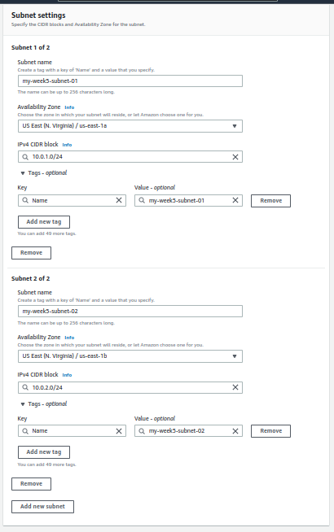
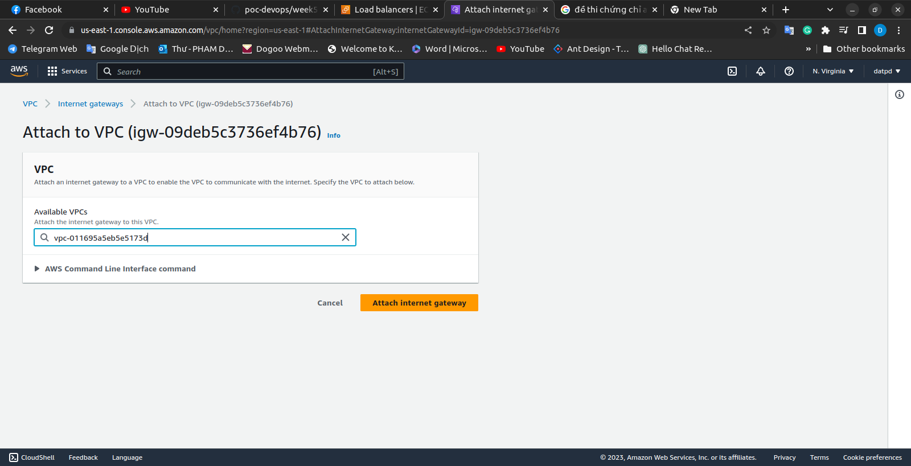
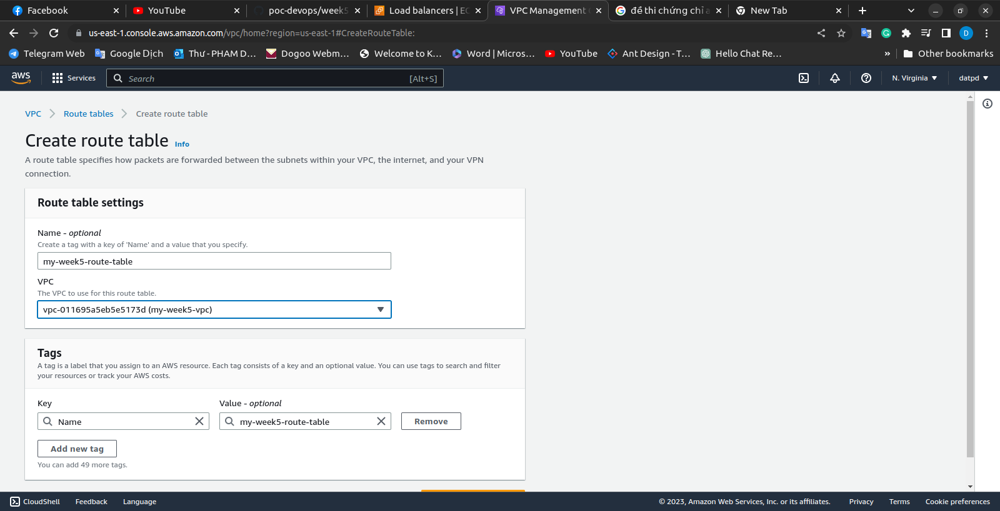
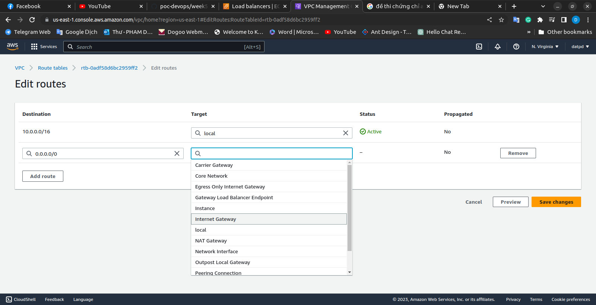
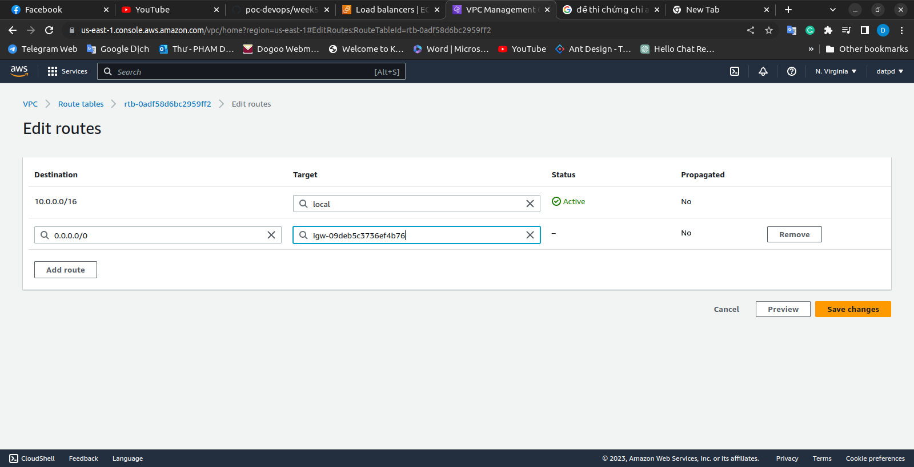
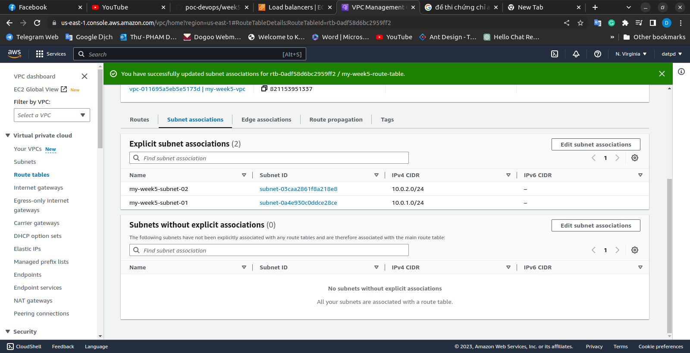

### Step 1: Create a VPC
1. Log in to the AWS Management Console and navigate to the Amazon VPC console.
2. Click on "Create VPC".
3. Enter a name for your VPC in the "Name tag" field.
4. Enter the IPv4 CIDR block for your VPC in the "IPv4 CIDR block" field. For this example, enter "10.0.0.0/16".
5. Click on "Create VPC".

### Step 2: Create Subnets

1. Click on "Subnets" in the left-hand menu.
2. Click on "Create subnet".
3. Enter a name for your subnet in the "Name tag" field.
4. Select the VPC you created in step 1 from the "VPC" dropdown list.
5. Enter the IPv4 CIDR block for your subnet in the "IPv4 CIDR block" field. For the first subnet, enter "10.0.1.0/24". For the second subnet, enter "10.0.2.0/24".
6. Select the availability zone you want to use for the subnet from the "Availability Zone" dropdown list.
7. Click on "Create subnet".

### Step 3: Create an Internet Gateway

1. Click on "Internet Gateways" in the left-hand menu.
2. Click on "Create internet gateway".
3. Enter a name for your internet gateway in the "Name tag" field.
4. Click on "Create internet gateway".
5. Select the internet gateway you just created from the list of internet gateways.
   

6. Click on "Actions" and select "Attach to VPC".

7. Select the VPC you created in step 1 from the "VPC" dropdown list.
8. Click on "Attach internet gateway".

### Step 4: Create a Route Table

1. Click on "Route Tables" in the left-hand menu.
2. Click on "Create route table".
3. Enter a name for your route table in the "Name tag" field.
4. Select the VPC you created in step 1 from the "VPC" dropdown list.
5. Click on "Create route table".
6. Select the route table you just created from the list of route tables.
7. Click on the "Routes" tab.
8. Click on "Edit routes".
9. Click on "Add route".
10. Enter "0.0.0.0/0" in the "Destination" field.
11. Select the internet gateway you created in step 3 from the "Target" dropdown list.
12. Click on "Save routes".

### Step 5: Associate Subnets with the Route Table

1. Select the route table you just created from the list of route tables.
2. Click on the "Subnet associations" tab.
3. Click on "Edit subnet associations".
4. Select the first subnet you created in step 2 from the list of subnets.
5. Click on "Save".
6. Repeat steps 3-5 to associate the second subnet with the route table.

