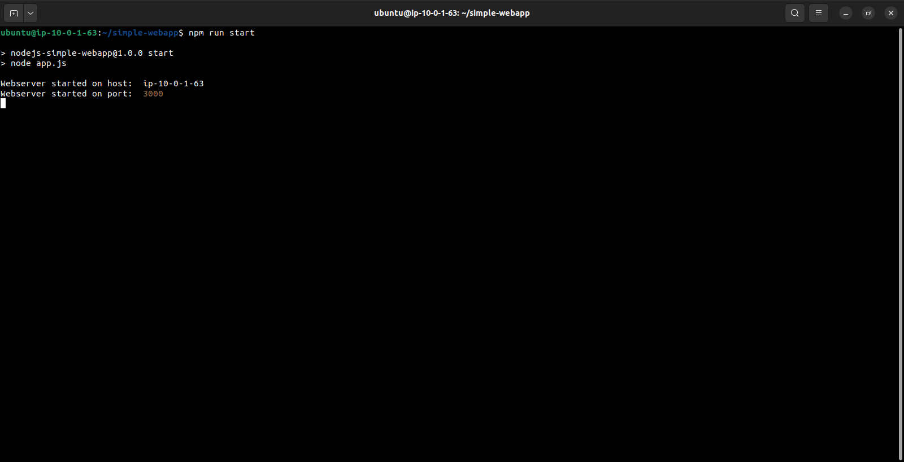
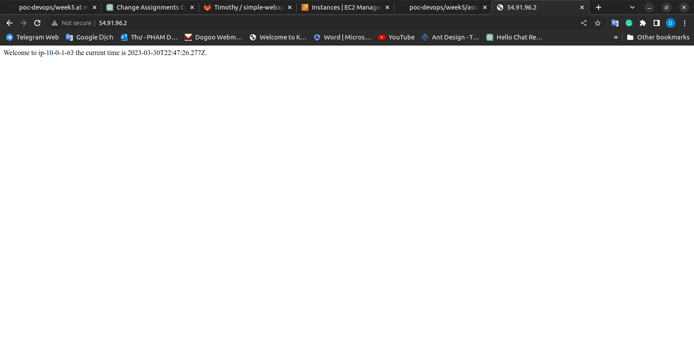

Install nodejs, npm and clone git:

After you launch instance of assign-2

1. Connect your instance from your terminal:
   
   
   In all of the assignments,Sometimes I make mistake or forget a step, so I may need modify the name, key, key pair, or
   other details. So, please don't get confused when you practice :))
   I'm sorry about it
2. Install Nodejs, NPM:
   `sudo apt-get update`
   `sudo apt-get install nodejs -y`
   `sudo apt-get install npm -y`

3. Start your git project:
   
4. Clone your teacher's git:
   `git clone https://gitlab.com/sealy/simple-webapp.git`
5. Set up:
   
6. Config your nginx to forward port 80 (TCP) to port 3000 (The port that your git project will run)
   `sudo vim /etc/nginx/sites-available/default`

   
   `   server {
   listen 80;
   server_name example.com; # Change this to your own domain name
   location / {
   proxy_pass http://localhost:3000;
   proxy_http_version 1.1;
   proxy_set_header Upgrade $http_upgrade;
   proxy_set_header Connection 'upgrade';
   proxy_set_header Host $host;
   proxy_cache_bypass $http_upgrade;
   }
   }`

   
   
   Press "ESC", type `:x` to quit and save file
   
7. Test the configuration by running:
   
8. Restart nginx:
   
   Starting now, if you access the IPv4 address of your instance through a browser, you'll see:
   
Install PM2 to run port 3000 after exit cloud
Repeat to a new instance for subnet-02