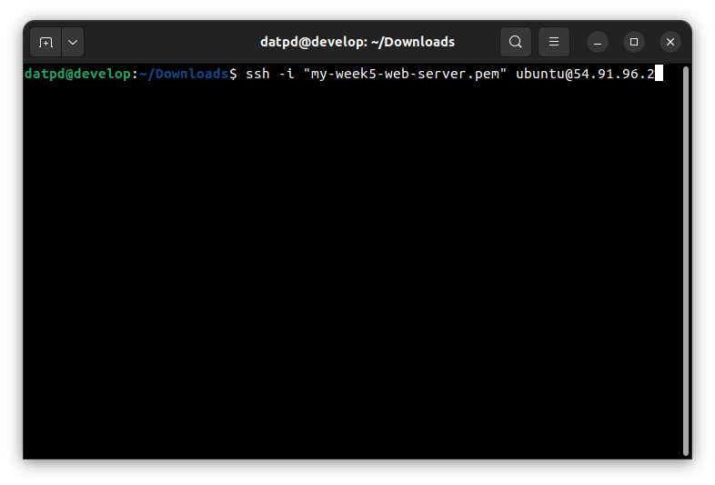
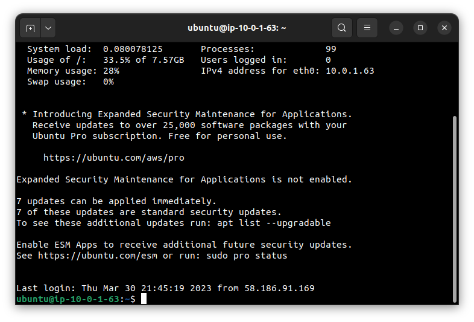
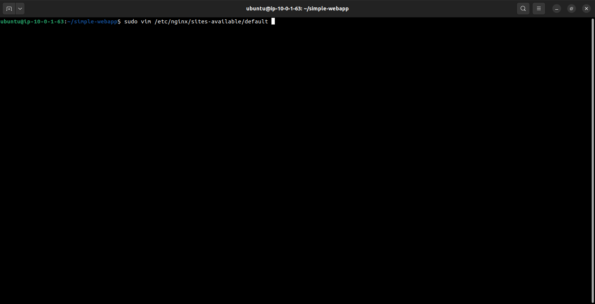
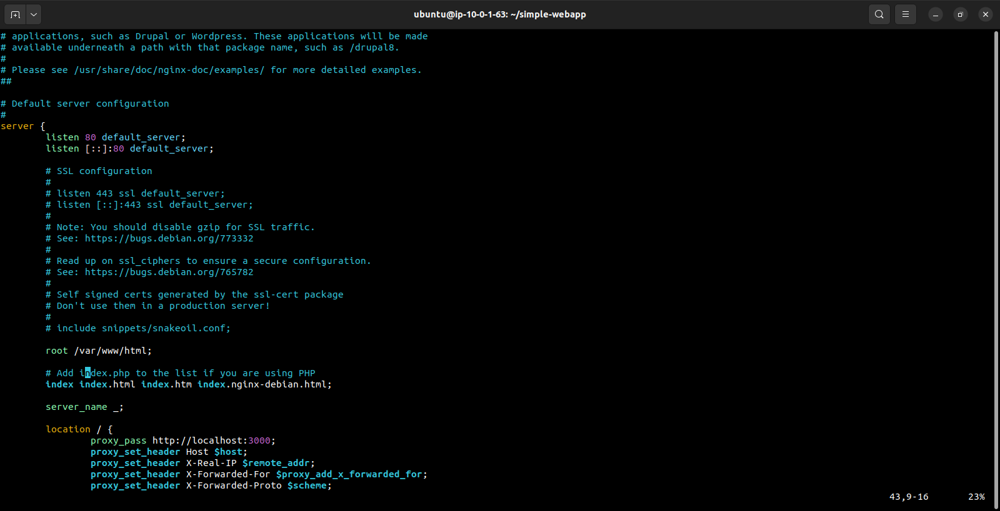
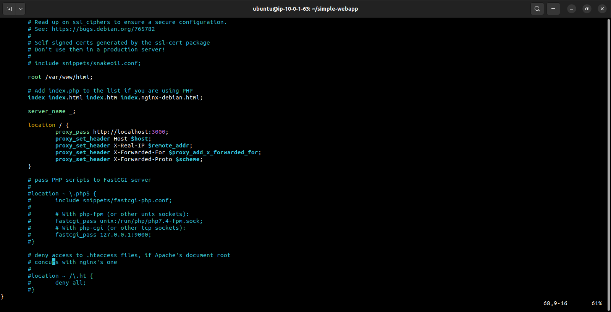
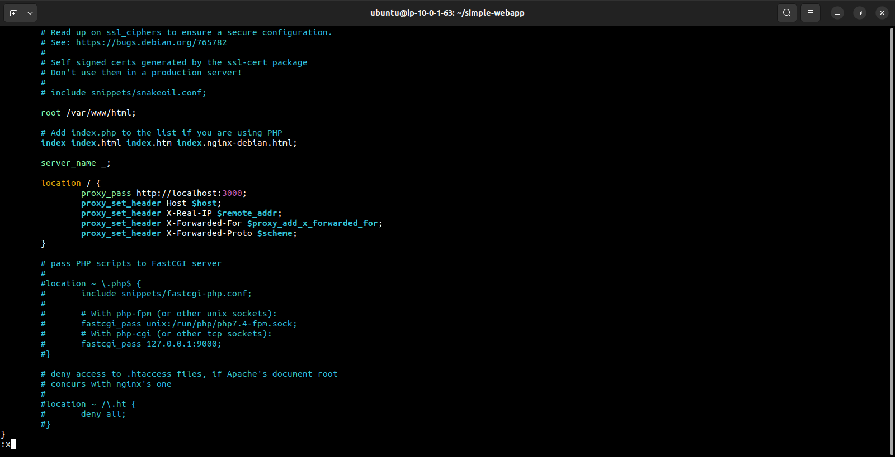
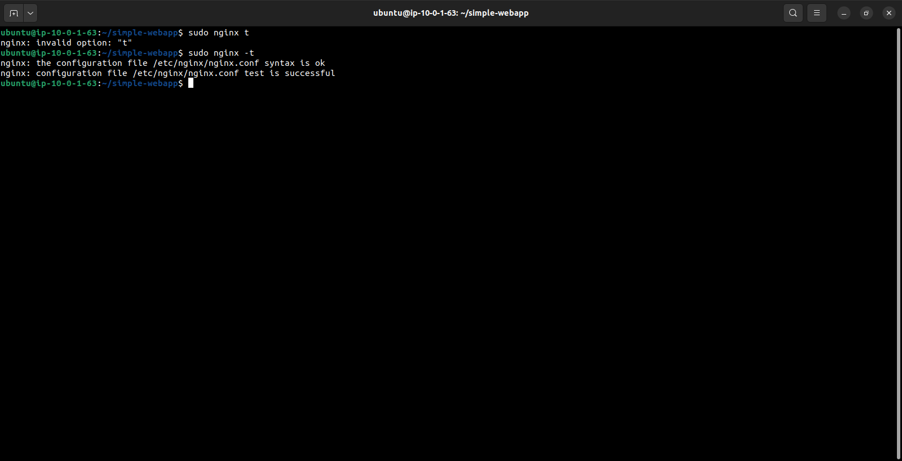
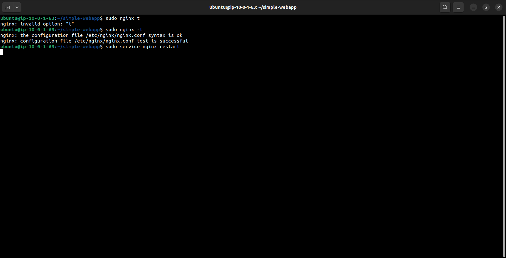

Install nodejs, npm and clone git:

After you launch instance of assign-2

1. Connect your instance from your terminal:
   
   
   In all of the assignments,Sometimes I make mistake or forget a step, so I may need modify the name, key, key pair, or
   other details. So, please don't get confused when you practice :))
   I'm sorry about it
2. Install Nodejs, NPM:
   sudo apt-get update
   sudo apt-get install nodejs
3. Clone your teacher's git:
   git clone https://gitlab.com/sealy/simple-webapp.git
4. Set up:
   
5. Config your nginx to forward port 80 (TCP) to port 3000 (The port that your git project will run)
   
   
   
   Press "ESC", type ":x" to quit and save file
   
6. Test the configuration by running:
   
7. Restart nginx:
   

Repeat to a new instance for subnet-02