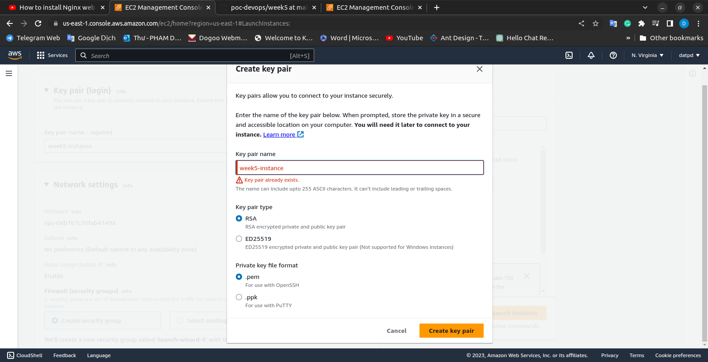
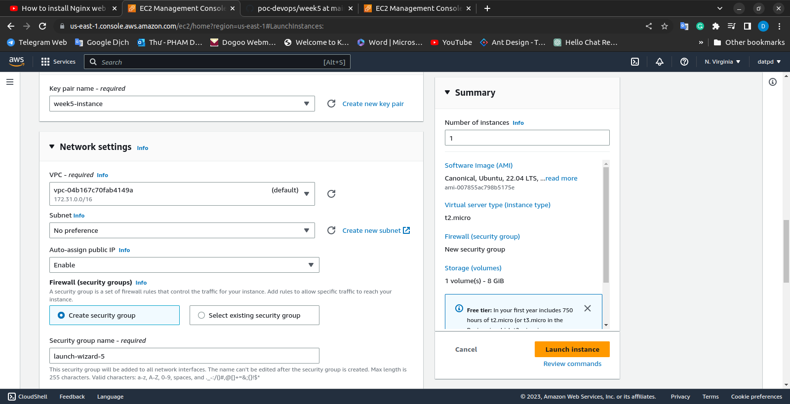
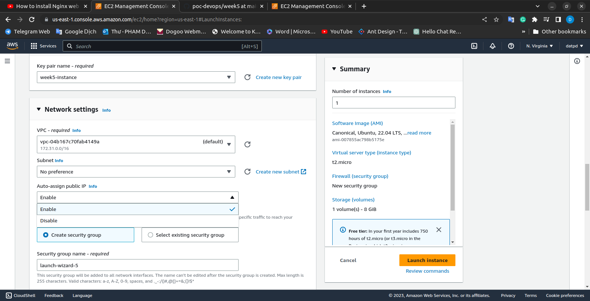
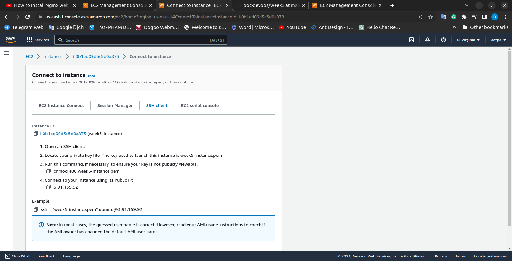

1. Log in to the AWS Management Console.
2. Open the Amazon EC2 console.
3. Click on the "Launch Instance" button.
   

4. Choose "Ubuntu Server 20.04 LTS (HVM), SSD Volume Type" as the Amazon Machine Image (AMI).
   

5. Choose "t2.micro" as the instance type.
   
   

6. Choose the VPC you created from the "Network" dropdown menu.

7. Choose one of the public subnets that you created from the "Subnet" dropdown menu.
   
   

8. Expand the "Advanced Details" section and paste the following script in the "User data" field:
`   #!/bin/bash
   sudo apt-get update
   sudo apt-get install -y nginx
   sudo service nginx start`
   This script installs Nginx on the instance and starts the Nginx service.
   

9. Click on the "Next: Add Storage" button.
10. Choose the default storage options and click on the "Next: Add Tags" button.
11. Add a "Name" tag for the instance and any other tags that you want to add.
12. Click on the "Next: Configure Security Group" button.
13. Create a new security group with the following settings:

    a. Choose the VPC you created from the "VPC" dropdown menu.
    b. Click on the "Add Rule" button.
    c. Choose "HTTP" as the "Type" and leave the "Source" as "Anywhere".
    d. Click on the "Review and Launch" button.

14. Review the instance details and click on the "Launch" button.
15. Choose an existing key pair or create a new one, and then click on the "Launch Instances" button.

Once the instance is launched, you can SSH into the instance using the key pair and the instance's public IP address. You should then be able to navigate to the public IP address in your web browser and see the Nginx welcome page.

